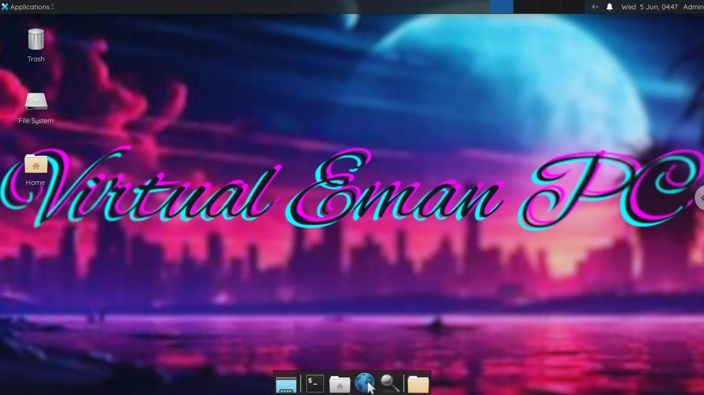

# Google Chrome Remote Desktop (CRD) RDP METHOD

## RDP with Google Chrome Remote Desktop (CRD) in Google Colab (Colaboratory)

# Read This Before Rushing To Download Colab Workflow 💀

* i'm **not responsible** for **suspended Google accounts**
* **Don't try these in your personal Gmail account** 
* **Don't Crypto mine , Instant Ban**

---
### Ubuntu 22.04.3 LTS

RDP Description:
* OS Name : Ubuntu 22.04.3 LTS.
* OS Type : 64-Bit.
* Xfce Version : Xubuntu.
* CPU : INTEL Xeon(R) CPU @ 2.20Ghz x 2.
* Memory : 12.7 GB RAM.
* GPU : llvmpipe (LLVM 15.0.7, 256bits) (12.7GB).
* We Have Some Cool Features That Other workflows Dosen't Have.
  - RDP Duration 12 hours.
  - Automatically Telegram Installed.
  - Automatically Google Chrome Installed.
  - Automatically Qbittorrent Installed.
  - Removed Stupid/Unrated Softwares.
  - Automatically Change Wallpaper.
  - You can custom PIN.
  - You can custom Username.
  - You can custom Password.
  - Ect ...

## Ubuntu RDP Install and Run
    
*  [**Click Here**](https://github.com/virtualEmanPC/RDP-with-Google-Chrome-Remote-Desktop-in-Google-Colab/blob/main/Command.txt) To Go View RDP Run Command And Copy.

*  Go To [**Google Colab**](https://colab.research.google.com/) And Create New Notbook.

* Past RDP Run Command And Press **Enter**.

* Go To [**Google Chrome Remote Desktop (CRD)**](https://remotedesktop.google.com/headless) . 

* Click **Begin Button**.

* Click **Next Button**.

* Click **Authorize Button**.

* Copy Your **Debian Linux SSH** Code **(token)**.

* Paste It In The **Colab** Then Press **Enter**.

* **Wait 2 - 3 Minutes**.

* After You See my **Banner Art** And **Remote Access Link**.

* Click **Remote Access Link** And Then Click **First Rimote Dives**.

* Give **Your PIN**.

* Now You're In , Enjoy.

### You Can See ID , Username , Pass , Pc Name And Cool Ascki Art 
